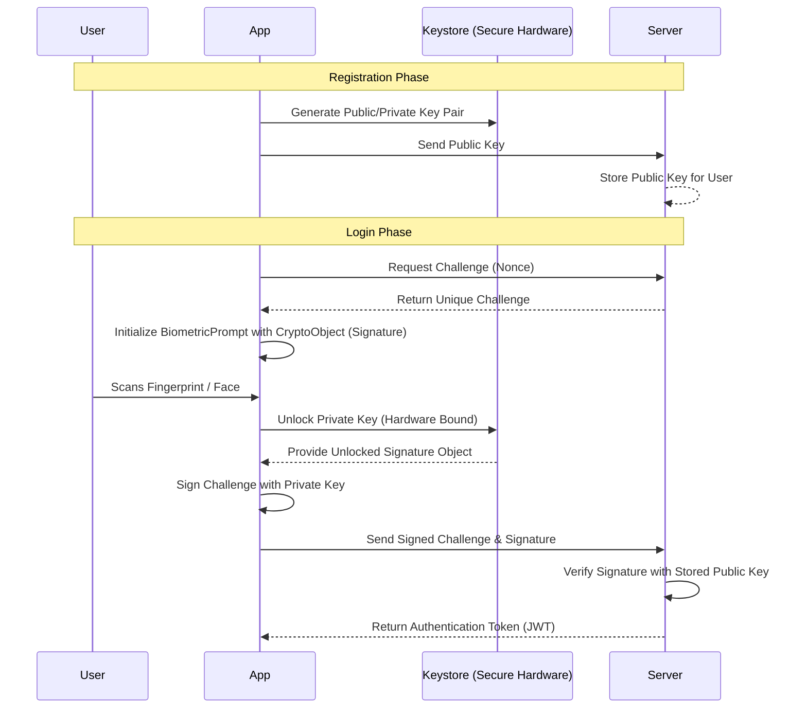
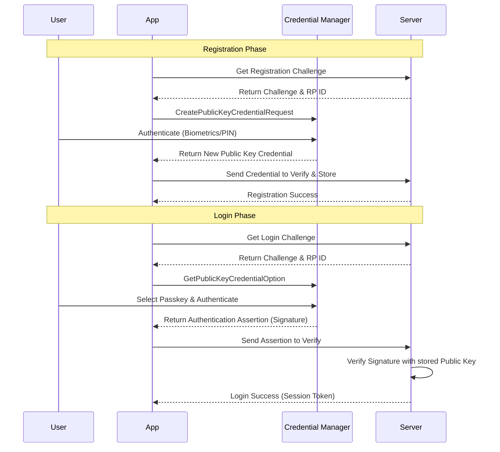

# Android Secure Login Demo 🔐

A modern Android application demonstrating the implementation of **Biometric Authentication** and **Passkeys** using **Jetpack Compose** and **MVVM Architecture**.

This project provides a comprehensive guide on how to implement high-security authentication flows with cryptographic backend verification.

---

## 🏗️ Project Structure

```text
com.rajendra.androidsecurelogin/
├── auth/
│   ├── BiometricAuthenticator.kt  # Core biometric logic & KDocs
│   ├── AuthViewModel.kt           # State management for biometrics
│   ├── PasskeyAuthenticator.kt    # FIDO2/WebAuthn logic using Credential Manager
│   └── PasskeyViewModel.kt        # State management for passkeys
├── ui/
│   ├── LoginScreen.kt             # Biometric UI with status feedback
│   ├── PasskeyLoginScreen.kt      # Passkey UI for registration & login
│   └── theme/                     # Material 3 Theme configurations
└── MainActivity.kt                # Navigation host & Main Selection UI
```

## 🛠️ Tech Stack

- **Language**: Kotlin
- **UI**: Jetpack Compose
- **Architecture**: MVVM (Model-View-ViewModel)
- **Security Libraries**: 
  - `androidx.biometric:biometric-ktx`
  - `androidx.credentials:credentials`
  - `androidx.credentials:credentials-play-services-auth`
- **Design**: Material 3

---

## 🔒 1. Biometric Authentication Guide

In the era of modern mobile applications, user experience and security must go hand in hand. **Biometric Authentication** (Fingerprint, Face, and Iris) has become the gold standard for providing quick yet highly secure access to sensitive information.

This guide explores how to implement a production-ready Biometric Login flow in Android using the **MVVM architecture** and best security practices.

### 🏗️ High-Level Design (HLD)

A common mistake is to treat biometric success as a simple “true/false” check. For a truly secure system, the authentication must be cryptographically verified by your backend server.

#### Authentication Flow Diagram



### 🛠️ Implementation Steps

#### 1. Add Dependencies & Permissions
Add the Biometric library to your `build.gradle.kts`:
```kotlin
dependencies {
    implementation("androidx.biometric:biometric-ktx:1.2.0-alpha05")
}
```
And add the permission to your `AndroidManifest.xml`:
```xml
<uses-permission android:name="android.permission.USE_BIOMETRIC" />
```

#### 2. The Authenticator Logic (The “How”)
We encapsulate the `BiometricPrompt` logic in a dedicated class. This class handles the system dialog and callbacks.

```kotlin
class BiometricAuthenticator(private val context: Context) {
    fun isBiometricAvailable(): Boolean {
        val biometricManager = BiometricManager.from(context)
        return biometricManager.canAuthenticate(
            BiometricManager.Authenticators.BIOMETRIC_STRONG
        ) == BiometricManager.BIOMETRIC_SUCCESS
    }

    fun promptBiometricAuth(
        activity: FragmentActivity,
        onSuccess: (BiometricPrompt.AuthenticationResult) -> Unit,
        onError: (Int, CharSequence) -> Unit
    ) {
        val executor = ContextCompat.getMainExecutor(activity)
        val biometricPrompt = BiometricPrompt(activity, executor,
            object : BiometricPrompt.AuthenticationCallback() {
                override fun onAuthenticationSucceeded(result: BiometricPrompt.AuthenticationResult) {
                    onSuccess(result)
                }
                // ... handle onAuthenticationError and onAuthenticationFailed
            })

        val promptInfo = BiometricPrompt.PromptInfo.Builder()
            .setTitle("Biometric Login")
            .setSubtitle("Sign in using your biometrics")
            .setNegativeButtonText("Use Password")
            .build()

        biometricPrompt.authenticate(promptInfo)
    }
}
```

#### 3. Managing State with ViewModel
Following MVVM, the ViewModel manages the authentication state (Idle, Loading, Success, Error) and ensures the UI remains reactive.

```kotlin
sealed class AuthState {
    object Idle : AuthState()
    object Loading : AuthState()
    data class Success(val message: String) : AuthState()
    data class Error(val message: String) : AuthState()
}

class AuthViewModel(private val authenticator: BiometricAuthenticator) : ViewModel() {
    private val _authState = MutableStateFlow<AuthState>(AuthState.Idle)
    val authState: StateFlow<AuthState> = _authState.asStateFlow()

    fun authenticate(activity: FragmentActivity) {
        _authState.value = AuthState.Loading
        authenticator.promptBiometricAuth(activity, 
            onSuccess = { result ->
                // Production: Use result.cryptoObject to sign a backend challenge
                _authState.value = AuthState.Success("Securely Authenticated!")
            },
            onError = { code, msg -> _authState.value = AuthState.Error(msg.toString()) }
        )
    }
}
```

#### 4. The User Interface (Jetpack Compose)
```kotlin
@Composable
fun LoginScreen(viewModel: AuthViewModel) {
    val state by viewModel.authState.collectAsState()

    Column(horizontalAlignment = Alignment.CenterHorizontally) {
        when (state) {
            is AuthState.Loading -> CircularProgressIndicator()
            is AuthState.Success -> Icon(Icons.Default.CheckCircle, tint = Color.Green)
            is AuthState.Error -> Text("Error: ${(state as AuthState.Error).message}")
            else -> Text("Please Authenticate")
        }

        Button(onClick = { viewModel.authenticate(activity) }) {
            Text("Login with Fingerprint")
        }
    }
}
```

### 🔐 Secure Backend Verification
For maximum security, always use **`CryptoObject`**.
1. Generate a KeyPair in the **Android Keystore** with `setUserAuthenticationRequired(true)`.
2. When `onAuthenticationSucceeded` is called, it means the private key is now “unlocked” for a short window.
3. Sign a **Server Challenge** with that private key.
4. Send the signature to your backend. The backend verifies it using the public key you registered during the user’s initial setup.

This ensures that even if a device is rooted, the biometric success cannot be “faked” because the private key never leaves the secure hardware.

---

## 🔑 2. Passkey Authentication Guide

**Passkeys** are the modern, more secure alternative to passwords. Based on the **FIDO2/WebAuthn** standard, they allow users to sign in to apps and websites using their device’s screen lock (fingerprint, face, or PIN). Unlike passwords, passkeys are unique to every account and never leave the user’s device.

In this guide, we’ll walk through implementing Passkey authentication in Android using the **Credential Manager API** and **MVVM architecture**.

### 🏗️ High-Level Design (HLD)
Passkey authentication involves a two-step handshake between the app and the backend server for both registration and login.

#### Passkey Authentication Flow Diagram


### 🛠️ Implementation Steps

#### 1. Add Dependencies
Add the Credential Manager and Play Services Auth libraries to your `build.gradle.kts`:
```kotlin
dependencies {
    implementation("androidx.credentials:credentials:1.5.0")
    implementation("androidx.credentials:credentials-play-services-auth:1.5.0")
    implementation("com.google.android.libraries.identity.googleid:googleid:1.1.1")
}
```

#### 2. The Passkey Authenticator Logic
The `PasskeyAuthenticator` encapsulates the `CredentialManager` calls. It handles the JSON interaction required for FIDO2.

```kotlin
class PasskeyAuthenticator(context: Context) {
    private val credentialManager = CredentialManager.create(context)

    suspend fun registerPasskey(activity: FragmentActivity, requestJson: String): Result<CreateCredentialResponse> {
        return try {
            val request = CreatePublicKeyCredentialRequest(requestJson)
            val result = credentialManager.createCredential(activity, request)
            Result.success(result)
        } catch (e: CreateCredentialException) {
            Result.failure(e)
        }
    }

    suspend fun loginWithPasskey(activity: FragmentActivity, requestJson: String): Result<GetCredentialResponse> {
        return try {
            val option = GetPublicKeyCredentialOption(requestJson)
            val request = GetCredentialRequest(listOf(option))
            val result = credentialManager.getCredential(activity, request)
            Result.success(result)
        } catch (e: GetCredentialException) {
            Result.failure(e)
        }
    }
}
```

#### 3. ViewModel Integration (MVVM)
The `ViewModel` handles the state transition and communicates with the backend to fetch challenges.

```kotlin
class PasskeyViewModel(private val authenticator: PasskeyAuthenticator) : ViewModel() {
    private val _uiState = MutableStateFlow<PasskeyUiState>(PasskeyUiState.Idle)
    val uiState: StateFlow<PasskeyUiState> = _uiState.asStateFlow()

    fun login(activity: FragmentActivity) {
        viewModelScope.launch {
            _uiState.value = PasskeyUiState.Loading
            // 1. Fetch challenge from your backend
            val challengeJson = repository.getLoginChallenge() 
            
            // 2. Trigger Credential Manager
            val result = authenticator.loginWithPasskey(activity, challengeJson)
            
            // 3. Verify assertion with backend
            result.onSuccess { 
                repository.verifyLoginAssertion(it)
                _uiState.value = PasskeyUiState.Success("Welcome back!")
            }.onFailure { 
                _uiState.value = PasskeyUiState.Error(it.message ?: "Login failed")
            }
        }
    }
}
```

#### 4. UI with Jetpack Compose
```kotlin
@Composable
fun PasskeyScreen(viewModel: PasskeyViewModel) {
    val uiState by viewModel.uiState.collectAsState()

    Card(modifier = Modifier.fillMaxWidth().padding(16.dp)) {
        Column(modifier = Modifier.padding(24.dp)) {
            Text("Passkey Authentication", style = MaterialTheme.typography.headlineSmall)
            
            Spacer(modifier = Modifier.height(16.dp))
            
            Button(
                onClick = { viewModel.login(activity) },
                enabled = uiState !is PasskeyUiState.Loading
            ) {
                Text("Sign in with Passkey")
            }
        }
    }
}
```

### 🔐 Why Passkeys are Better
1. **Phishing Resistant**: Passkeys are bound to the domain (RP ID). A user cannot accidentally “type” their passkey into a fake website.
2. **No More Passwords**: Users don’t need to remember anything. They use the same biometric flow they use to unlock their phone.
3. **Sync-able**: Passkeys are backed up to the cloud (e.g., Google Password Manager) and work across all the user’s Android devices.

---

## 🚦 Getting Started

1. **Clone the repository.**
2. **Sync the project** with Gradle.
3. **Run on a device/emulator**:
   - For **Biometric**: Ensure your device has biometrics enrolled.
   - For **Passkey**: Requires a device with Play Services and an active Google Account.

## ⚠️ Security Note

This demo uses mocked backend responses. In production, successful authentication results **must** be verified by your server. Detailed implementation notes are provided in the **KDoc** of each `Authenticator` class.
---

Images:


Developed with ❤️ for secure Android development.
