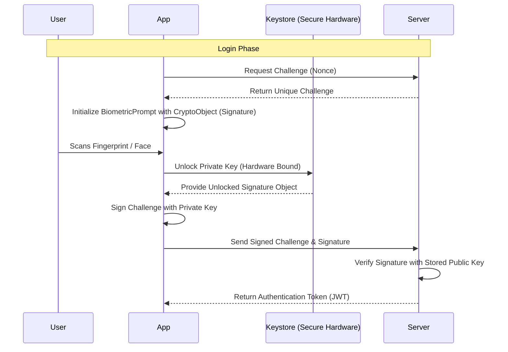
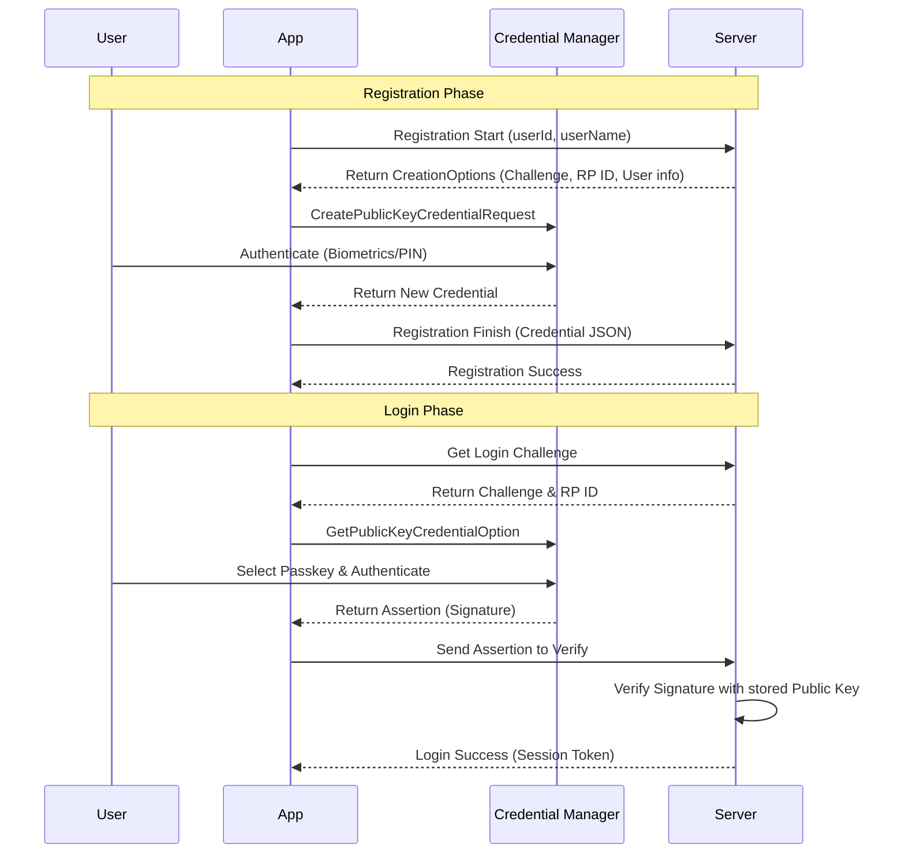

# Android Secure Login Demo 🔐

A modern Android application demonstrating the implementation of **Biometric Authentication** and **Passkeys** using **Jetpack Compose** and **MVVM Architecture**.

This project serves as a complete technical guide for integrating high-security authentication flows with cryptographic backend verification.

---

## 🏗️ Project Structure

```text
com.rajendra.androidsecurelogin/
├── auth/
│   ├── BiometricAuthenticator.kt  # Core biometric logic & KDocs
│   ├── AuthViewModel.kt           # State management for biometrics
│   ├── PasskeyAuthenticator.kt    # FIDO2/WebAuthn logic using Credential Manager
│   └── PasskeyViewModel.kt        # State management for passkeys
├── ui/
│   ├── LoginScreen.kt             # Biometric UI with status feedback
│   ├── PasskeyLoginScreen.kt      # Passkey UI for registration & login
│   └── theme/                     # Material 3 Theme configurations
└── MainActivity.kt                # Navigation host & Main Selection UI
```

## 🛠️ Tech Stack

- **Language**: Kotlin
- **UI**: Jetpack Compose
- **Architecture**: MVVM (Model-View-ViewModel)
- **Security Libraries**: 
  - `androidx.biometric:biometric-ktx`
  - `androidx.credentials:credentials`
  - `androidx.credentials:credentials-play-services-auth`
- **Design**: Material 3

---

## 🔒 1. Biometric Authentication Guide

**Biometric Authentication** (Fingerprint, Face, and Iris) provides quick yet highly secure access. For a truly secure system, the authentication must be cryptographically verified by your backend server.

### 🏗️ High-Level Design (HLD)



### 🛠️ Android Implementation Steps

#### 1. Add Dependencies & Permissions
```kotlin
// build.gradle.kts
dependencies {
    implementation("androidx.biometric:biometric-ktx:1.2.0-alpha05")
}
```
Add to `AndroidManifest.xml`:
```xml
<uses-permission android:name="android.permission.USE_BIOMETRIC" />
```

#### 2. The Authenticator Logic
We encapsulate `BiometricPrompt` logic in a dedicated class. Using a `CryptoObject` is essential for backend verification.

```kotlin
class BiometricAuthenticator(private val context: Context) {
    fun promptBiometricAuth(
        activity: FragmentActivity,
        onSuccess: (BiometricPrompt.AuthenticationResult) -> Unit
    ) {
        val executor = ContextCompat.getMainExecutor(activity)
        val biometricPrompt = BiometricPrompt(activity, executor,
            object : BiometricPrompt.AuthenticationCallback() {
                override fun onAuthenticationSucceeded(result: BiometricPrompt.AuthenticationResult) {
                    onSuccess(result)
                }
            })
        // ... build promptInfo and authenticate
    }
}
```

#### 3. State Management (ViewModel)
The `ViewModel` manages the authentication state (`Idle`, `Loading`, `Success`, `Error`).

```kotlin
class AuthViewModel(private val authenticator: BiometricAuthenticator) : ViewModel() {
    private val _authState = MutableStateFlow<AuthState>(AuthState.Idle)
    val authState: StateFlow<AuthState> = _authState.asStateFlow()

    fun authenticate(activity: FragmentActivity) {
        _authState.value = AuthState.Loading
        authenticator.promptBiometricAuth(activity, 
            onSuccess = { result ->
                // Production: Use result.cryptoObject to sign a backend challenge
                _authState.value = AuthState.Success("Securely Authenticated!")
            }
        )
    }
}
```

### 📋 Backend API Contracts (Biometric)

#### Verify Signature
- **Endpoint**: `POST /api/auth/biometric/verify`
- **Request Body**:
```json
{
  "userId": "user-123",
  "challenge": "server-generated-nonce",
  "signature": "base64-encoded-signature-from-crypto-object"
}
```

---

## 🔑 2. Passkey Authentication Guide

**Passkeys** are the modern replacement for passwords, based on the **FIDO2/WebAuthn** standard. They allow users to sign in using their device’s screen lock and are resistant to phishing.

### 🏗️ High-Level Design (HLD)



### 🛠️ Android Implementation Steps

#### 1. Add Dependencies
```kotlin
// build.gradle.kts
dependencies {
    implementation("androidx.credentials:credentials:1.5.0")
    implementation("androidx.credentials:credentials-play-services-auth:1.5.0")
}
```

#### 2. The Passkey Authenticator
Handles JSON interaction required for FIDO2 via the `CredentialManager` API.

```kotlin
class PasskeyAuthenticator(context: Context) {
    suspend fun loginWithPasskey(activity: FragmentActivity, requestJson: String): Result<GetCredentialResponse> {
        return try {
            val option = GetPublicKeyCredentialOption(requestJson)
            val request = GetCredentialRequest(listOf(option))
            Result.success(credentialManager.getCredential(activity, request))
        } catch (e: GetCredentialException) {
            Result.failure(e)
        }
    }
}
```

#### 3. UI with Jetpack Compose
We observe the `ViewModel` state to provide dynamic feedback to the user.

```kotlin
@Composable
fun PasskeyScreen(viewModel: PasskeyViewModel) {
    val uiState by viewModel.uiState.collectAsState()
    // ... UI Logic with Material 3 Cards and Icons
}
```

### 📋 Backend API Contracts (Passkey)

#### A. Registration Finish
- **Endpoint**: `POST /api/passkey/register/finish`
- **Payload**:
```json
{
  "userId": "user-123",
  "credential": {
    "id": "base64-id",
    "rawId": "base64-id",
    "type": "public-key",
    "response": {
      "attestationObject": "base64-data",
      "clientDataJSON": "base64-data"
    },
    "authenticatorAttachment": "platform"
  }
}
```

#### B. Login Finish (Assertion)
- **Endpoint**: `POST /api/passkey/login/finish`
- **Payload**:
```json
{
  "userId": "user-123",
  "credential": {
    "id": "base64-id",
    "rawId": "base64-id",
    "type": "public-key",
    "response": {
      "authenticatorData": "base64-data",
      "clientDataJSON": "base64-data",
      "signature": "base64-signature",
      "userHandle": "base64-user-id"
    }
  }
}
```

---

## 🚦 Getting Started

1. **Clone the repository.**
2. **Sync the project** with Gradle.
3. **Run on a device/emulator**:
    - For **Biometric**: Ensure your device has biometrics enrolled.
    - For **Passkey**: Requires a device with Play Services and an active Google Account.

## ⚠️ Security Note

This demo uses mocked backend responses. In production, successful authentication results **must** be verified by your server using the cryptographic contracts defined above. Detailed implementation notes are provided in the **KDoc** of each `Authenticator` class.

---
Developed with ❤️ for secure Android development.
