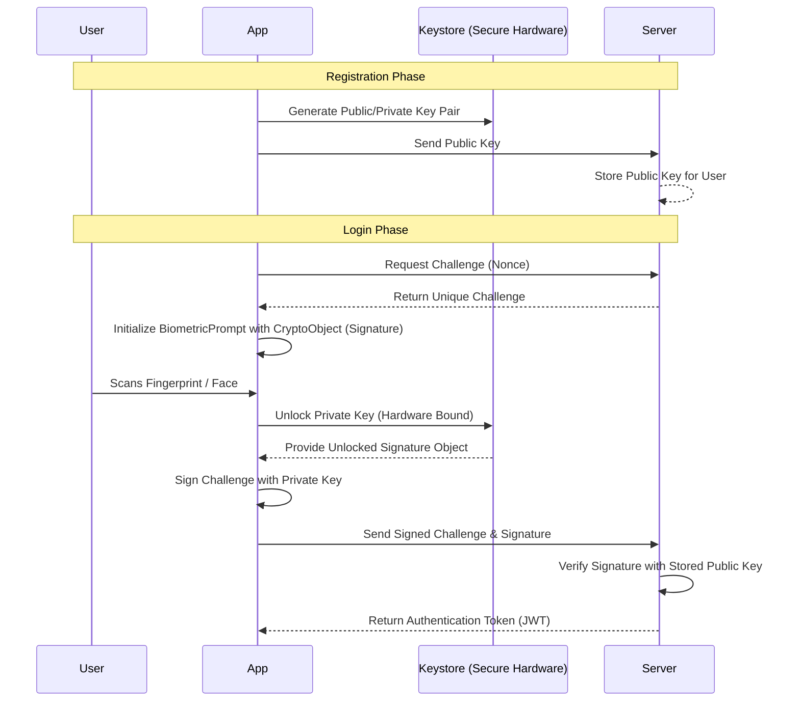
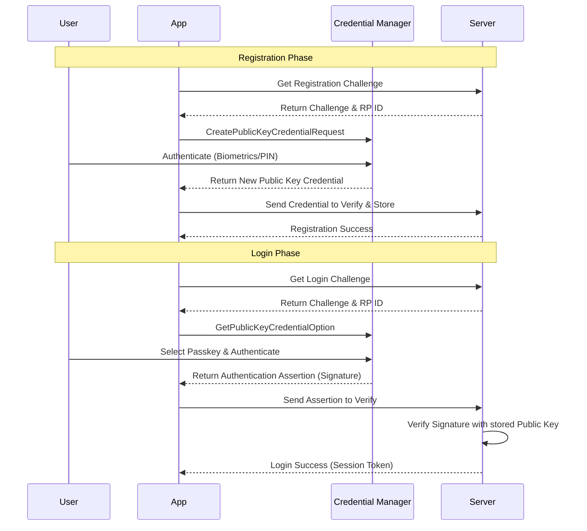

# Android Secure Login Demo 🔐

A modern Android application demonstrating the implementation of **Biometric Authentication** and **Passkeys** using **Jetpack Compose** and **MVVM Architecture**.

This project provides a comprehensive guide on how to implement high-security authentication flows with cryptographic backend verification.

---

## 🏗️ Project Structure

```text
com.rajendra.androidsecurelogin/
├── auth/
│   ├── BiometricAuthenticator.kt  # Core biometric logic & KDocs
│   ├── AuthViewModel.kt           # State management for biometrics
│   ├── PasskeyAuthenticator.kt    # FIDO2/WebAuthn logic using Credential Manager
│   └── PasskeyViewModel.kt        # State management for passkeys
├── ui/
│   ├── LoginScreen.kt             # Biometric UI with status feedback
│   ├── PasskeyLoginScreen.kt      # Passkey UI for registration & login
│   └── theme/                     # Material 3 Theme configurations
└── MainActivity.kt                # Navigation host & Main Selection UI
```

## 🛠️ Tech Stack

- **Language**: Kotlin
- **UI**: Jetpack Compose
- **Architecture**: MVVM (Model-View-ViewModel)
- **Security Libraries**: 
  - `androidx.biometric:biometric-ktx`
  - `androidx.credentials:credentials`
  - `androidx.credentials:credentials-play-services-auth`
- **Design**: Material 3

---

## 🔒 1. Biometric Authentication Guide

**Biometric Authentication** (Fingerprint, Face, and Iris) provides quick yet highly secure access. For a truly secure system, the authentication must be cryptographically verified by your backend server.

### 🏗️ High-Level Design (HLD)



### 🛠️ Implementation Steps

#### Step 1: The Authenticator Logic
We encapsulate `BiometricPrompt` logic in a dedicated class to handle system dialogs and callbacks.

```kotlin
class BiometricAuthenticator(private val context: Context) {
    fun promptBiometricAuth(
        activity: FragmentActivity,
        onSuccess: (BiometricPrompt.AuthenticationResult) -> Unit,
        onError: (Int, CharSequence) -> Unit
    ) {
        val executor = ContextCompat.getMainExecutor(activity)
        val biometricPrompt = BiometricPrompt(activity, executor,
            object : BiometricPrompt.AuthenticationCallback() {
                override fun onAuthenticationSucceeded(result: BiometricPrompt.AuthenticationResult) {
                    onSuccess(result)
                }
            })
        // ... build promptInfo and authenticate
    }
}
```

#### Step 2: State Management (ViewModel)
The `ViewModel` manages the authentication state and orchestrates the signing process with the backend.

```kotlin
class AuthViewModel(private val authenticator: BiometricAuthenticator) : ViewModel() {
    private val _authState = MutableStateFlow<AuthState>(AuthState.Idle)
    val authState: StateFlow<AuthState> = _authState.asStateFlow()

    fun authenticate(activity: FragmentActivity) {
        _authState.value = AuthState.Loading
        authenticator.promptBiometricAuth(activity, 
            onSuccess = { result ->
                // Production: Use result.cryptoObject to sign a backend challenge
                _authState.value = AuthState.Success("Securely Authenticated!")
            },
            onError = { code, msg -> _authState.value = AuthState.Error(msg.toString()) }
        )
    }
}
```

### 🔐 Backend Communication (Login Verification)
To securely verify a biometric login, send the following payload to your API:

**Request JSON:**
```json
{
  "challenge": "server-generated-nonce",
  "signature": "base64-encoded-signature-from-crypto-object",
  "userId": "user-unique-identifier"
}
```

---

## 🔑 2. Passkey Authentication Guide

**Passkeys** are based on the **FIDO2/WebAuthn** standard, allowing users to sign in using their device’s screen lock.

### 🏗️ High-Level Design (HLD)



### 🛠️ Implementation Steps

#### Step 1: The Passkey Authenticator
Handles JSON interaction required for FIDO2 via `CredentialManager`.

```kotlin
class PasskeyAuthenticator(context: Context) {
    suspend fun loginWithPasskey(activity: FragmentActivity, requestJson: String): Result<GetCredentialResponse> {
        return try {
            val option = GetPublicKeyCredentialOption(requestJson)
            val request = GetCredentialRequest(listOf(option))
            Result.success(credentialManager.getCredential(activity, request))
        } catch (e: GetCredentialException) {
            Result.failure(e)
        }
    }
}
```

#### Step 2: ViewModel Integration
Manages the two-step registration and login handshake.

```kotlin
class PasskeyViewModel(private val authenticator: PasskeyAuthenticator) : ViewModel() {
    fun login(activity: FragmentActivity) {
        viewModelScope.launch {
            _uiState.value = PasskeyUiState.Loading
            val challengeJson = repository.getLoginChallenge() 
            val result = authenticator.loginWithPasskey(activity, challengeJson)
            result.onSuccess { 
                repository.verifyLoginAssertion(it)
                _uiState.value = PasskeyUiState.Success("Welcome back!")
            }
        }
    }
}
```

### 🔐 Backend Communication (FIDO2 Payloads)

#### Passkey Registration Finish
```json
{
  "id": "base64-credential-id",
  "rawId": "base64-credential-id",
  "type": "public-key",
  "response": {
    "attestationObject": "base64-attestation-data",
    "clientDataJSON": "base64-client-data-json"
  },
  "authenticatorAttachment": "platform"
}
```

#### Passkey Login Finish (Assertion)
```json
{
  "id": "base64-credential-id",
  "rawId": "base64-credential-id",
  "type": "public-key",
  "response": {
    "authenticatorData": "base64-auth-data",
    "clientDataJSON": "base64-client-data-json",
    "signature": "base64-signature",
    "userHandle": "base64-user-id"
  }
}
```

---

## 🚦 Getting Started

1. **Clone the repository.**
2. **Sync the project** with Gradle.
3. **Run on a device/emulator**:
    - For **Biometric**: Ensure your device has biometrics enrolled.
    - For **Passkey**: Requires a device with Play Services and an active Google Account.

## ⚠️ Security Note

This demo uses mocked backend responses. In production, successful authentication results **must** be verified by your server. Detailed implementation notes are provided in the **KDoc** of each `Authenticator` class.

---
Developed with ❤️ for secure Android development.
